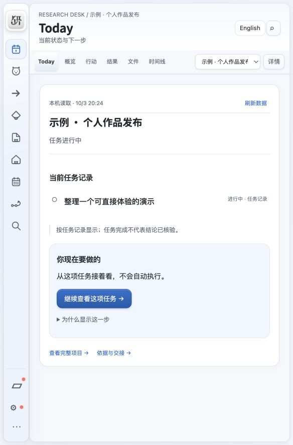
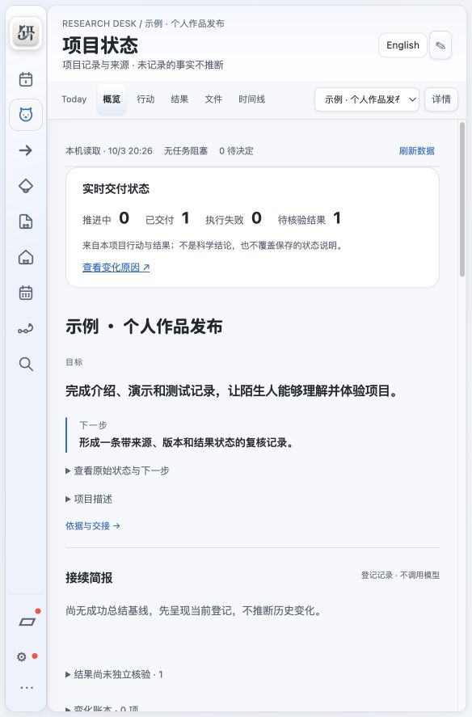

<p align="center"></p>

<h1 align="center">研序 · Yanxu</h1>
<p align="center"><strong>把散落在 AI 对话与文件中的工作，接成有依据、能继续的项目。</strong></p>
<p align="center">A local-first desktop workspace for continuing long-running projects with AI agents.</p>
<p align="center">
  <a href="LICENSE"></a>
  
  
  
</p>
<p align="center"><a href="https://github.com/lingyi-liusd/yanxu/releases/tag/v2026.10.03-beta.16">下载测试版</a> · <a href="#快速体验">快速体验</a> · <a href="docs/ARCHITECTURE.md">架构</a> · <a href="docs/PRODUCT-STORY.md">产品设计</a> · <a href="README.en.md">English</a></p>



## 为什么做研序

用 AI 做一个持续数周的项目，真正困难的往往是第二天如何接着做：目标埋在旧对话里，进度散在文件里，Agent 说“完成”却没有说明结论依据什么。换一个会话，又需要重新解释项目。

研序把目标、任务、Agent 行动、成果、结果和来源放进同一个项目。人可以看到当前工作和下一步；Agent 可以读取同一份项目上下文，按明确范围推进并登记结果。

## 可以做什么

| 场景 | 研序提供的入口 |
| --- | --- |
| 隔几天重新打开项目 | Today 的当前记录、必要提醒与一个下一步入口 |
| 计划和推进工作 | 任务、依赖、行动泳道、日历与时间线 |
| 找到结论依据 | 成果引用、来源对象与版本、结果和核验状态 |
| 换一个 Agent 接手 | 项目级 MCP、上下文快照、原行动条件与已耗预算 |
| 理解 AI 最近做了什么 | 可选的 Codex 管理总结、变化说明与人批只读核查 |
| 管理本地资料 | 按项目绑定目录，分别授权读取、PDF/DOCX 文字提取和发送正文 |

**任务完成、结果通过、独立核验是三个不同的判断。** 失败、部分完成、未知和未核验记录都可以保留，避免让漂亮的摘要替代原依据。



## 快速体验

### 下载桌面测试版

从 [Releases](https://github.com/lingyi-liusd/yanxu/releases) 下载 `2026.10.03-beta.16`。运行依赖随包提供。

| 安装包 | 使用方式 | 当前验证范围 |
| --- | --- | --- |
| macOS / Apple Silicon | 解压，打开「研序测试版.app」 | 本版离线运行库自检 PASS；本版原生 GUI 验收 NOT_RUN；ad-hoc 签名，未公证 |
| Windows 10/11 / x64 | 完整解压，运行「一键安装.cmd」或「打开研序.cmd」 | 文件与 x64 格式检查 PASS；Windows 真机安装与运行 NOT_RUN |

Intel Mac、Windows ARM 和 Linux 暂无桌面安装包。系统阻止打开时，请反馈原始提示。完整步骤见 [使用指南](docs/GETTING-STARTED.md)。

### 从源码运行

普通项目管理使用 Python 标准库。建议 Python 3.13；开发回归另需 Node 22。PDF 文字提取使用仓库内固定版本的 wheel，无需全局安装。

```sh
git clone https://github.com/lingyi-liusd/yanxu.git
cd yanxu
python3 launcher.py
```

浏览器访问 `http://127.0.0.1:8765`。数据保存在本机用户数据目录，与源码分开。AI 默认关闭；先创建一个项目、保存笔记、退出重开，再决定是否连接自己的 Codex 账号。

### 不登录，体验合成项目

```sh
python3 scripts/start_demo.py
```

打开脚本打印的本机地址，在「示例 · 个人作品发布」中查看 Today、项目状态、行动、结果与依据、排期和时间线。示例使用新建的临时数据目录，退出终端会停止演示服务；不读取个人文件、不调用模型、不修改正常工作空间。示例中的结果和截图是人工合成记录，用来展示软件流程。

## Agent 如何接入

在「AI 设置 · Agents」中为当前项目生成 MCP 配置。研序不会直接覆盖全局 Codex 配置。外部 Agent 的主要流程是：

```text
project.get_context → 核对目标、来源版本与边界
project.claim_action → 认领有产出、判据、预算与停止条件的行动
project.report_activity → 报告进度
project.add_artifact / project.record_result → 登记成果、来源版本与结果
```

生成配置不等于已连接。Agent 报告的结果默认 `UNVERIFIED`；项目级新接口与旧兼容接口的隔离边界不同。详见 [Agent 约定](AGENTS.md) 与 [管理连接说明](AGENT-MANAGER.md)。

## 技术实现

- **界面：** HTML、CSS、原生 JavaScript；保留导航、项目上下文和工作详情的三栏布局。
- **服务与存储：** Python 本机 HTTP 服务、SQLite、增量迁移、版本检查与 SSE 更新。
- **Agent 接入：** Node MCP stdio 服务、项目级令牌和 Action/Result/Evidence 记录。
- **桌面分发：** macOS AppKit/WKWebView 宿主；Windows 安装脚本与 Edge 应用窗口。
- **文档处理：** 受限子进程提取 PDF/DOCX 文字，保留原文件版本、处理覆盖和缺口。

[架构与数据流](docs/ARCHITECTURE.md) · [产品问题与设计取舍](docs/PRODUCT-STORY.md) · [发布验证范围](docs/VALIDATION.md)

## 开发与贡献

```sh
python3 scripts/verify_release.py
```

回归使用合成数据和隔离目录，覆盖版本冲突、授权撤回、来源变化、重复认领、失败保留和界面状态。CI 状态以仓库实际运行结果为准；自动回归不替代原生安装、真实登录、多日运行或用户收益验证。

欢迎提交具体问题和小范围改进。见 [贡献说明](CONTRIBUTING.md) 与 [安全边界](SECURITY.md)。

## 当前边界与路线

这是个人维护的开源测试版，适合个人科研、开发、产品设计与写作项目的试用。它仍是本机单人软件；工作区路径规则不是操作系统沙箱，尚无跨 Agent 文件写入锁。模型摘要不证明全部资料已理解，也不证明科学结论成立。

下一步优先完善首次安装、Windows 真机验证、跨机器稳定性与英汉高级文案，再根据反馈调整产品。完整 [路线图](ROADMAP.md) 中的待办均不作为当前功能承诺。

## License

研序自身源码采用 [MIT License](LICENSE)。随包第三方运行库、文档依赖与字体遵循各自许可，见 [第三方声明](THIRD-PARTY-NOTICES.md)。
