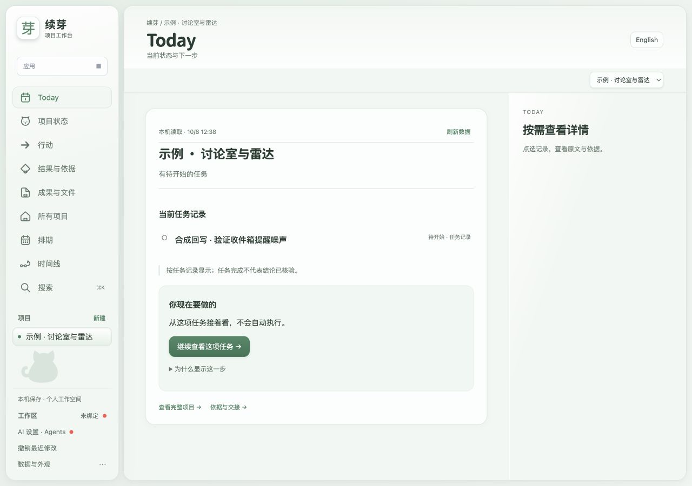
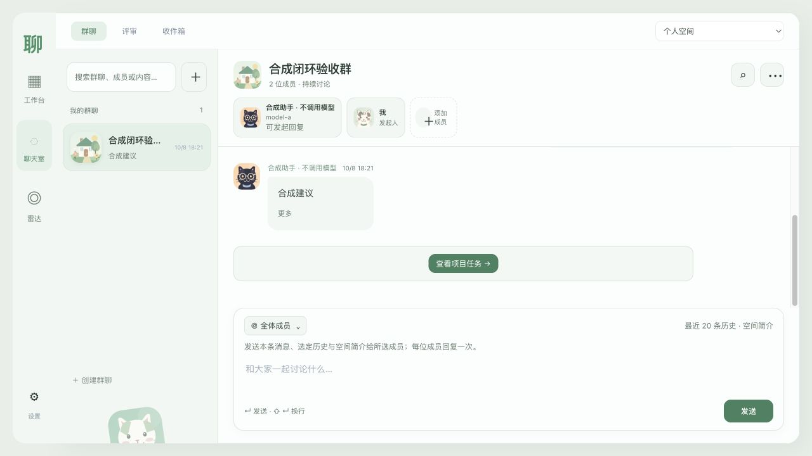
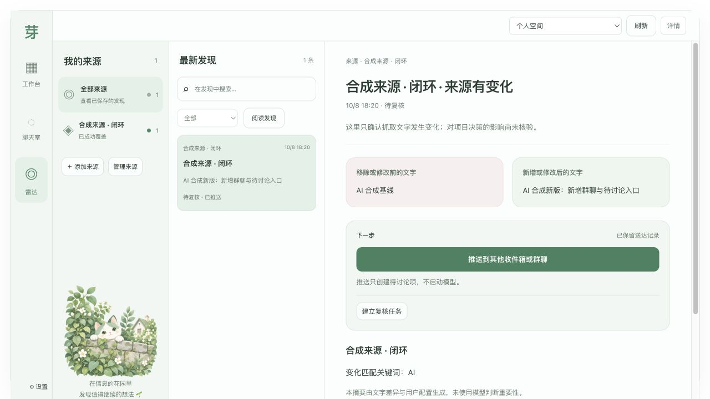

# 续芽 · 工作台、聊天室与雷达

**发现变化，把不同模型拉进群聊，再把确认的下一步送回项目。**

续芽（原研序 / Yanxu）是本机运行、面向个人的 AI 项目协作工具。三个应用有独立入口，共享项目、成员、来源版本和待讨论项。适合 AI 产品经理、研究者、独立开发者，以及希望持续追踪信息和保留决策依据的人。

> 2026-10-08 发布的是生态**源码预览版**。Releases 中的桌面 beta.16 是历史安装包，不包含本版新界面和群聊/雷达能力。真实模型质量、用户收益和跨平台安装仍有验证缺口。

[English](README.en.md) · [源码发布](https://github.com/lingyi-liusd/yanxu/releases/tag/v2026.10.08-source-preview.2) · [架构](docs/ecosystem/ARCHITECTURE-V2.md)

## 三个独立入口

| 应用 | 使用场景 | 入口 |
| --- | --- | --- |
| 工作台 | 项目目标、任务、Agent 行动、成果与依据、接续交接 | `/` |
| 聊天室 | 自建群聊，邀请不同模型/Agent，持续讨论并保留观点 | `/apps/discussion/` |
| 雷达 | 关注公开来源，比较前后变化，推送待讨论项 | `/apps/radar/` |





界面采用奶白与浅绿配色、猫咪成员头像和花园群头像。截图展示合成流程，不能代表真实模型效果。

## 从源码运行

推荐 Python 3.13 与 Node.js 22。普通功能使用 Python 标准库；PDF 解析的固定依赖包含在 vendor 中。

```sh
git clone https://github.com/lingyi-liusd/yanxu.git
cd yanxu
python3 launcher.py
```

也可运行隔离示例：

```sh
python3 scripts/start_demo.py
```

打开终端打印的本机地址；通过侧栏切换三个应用。聊天室和雷达可先使用个人空间，再关联工作台项目。示例不读取个人文件或调用模型；新建的临时数据目录随退出清理。

## 一个受控闭环

1. 添加公开来源，首次成功检查建立基线。
2. 雷达发现变化，保存来源版本与差异摘录。
3. 推送到收件箱或指定群聊，只创建待讨论项并提醒。
4. 人确认问题、回复成员和历史范围后启动讨论。不可用成员会阻止启动。
5. 人采纳为项目任务或决策，保留来源引用与版本，默认 `UNVERIFIED`。

检查失败、未检查和材料过期分别显示；没有发现不代表没有变化。AI 建议与任务完成不会自动变成已核验结论。

模型访问需要用户自己的账号/服务。Codex 连接和项目级 MCP 是可选能力；配置与真实握手、模型可用性分别判断。[接入契约](docs/ecosystem/OPEN-CONTRACT.md)

## 技术与验证

原生 JavaScript / HTML / CSS；Python HTTP 服务；SQLite 持久化；项目级 MCP 与可选 Codex App Server。无第三方前端框架。三个入口共享本机核心服务，写入使用预检查和版本校验。

```sh
python3 scripts/verify_release.py
```

[发布验证范围](docs/receipts/source-preview-v2-20261008.json)明确区分软件回归、合成闭环和真实模型效果。尚未完成 Windows 新版原生安装、长期稳定性和独立用户收益验收。本版深浅色与窄屏已完成本机浏览器走查。

[贡献说明](CONTRIBUTING.md) · [安全说明](SECURITY.md) · [第三方许可](THIRD-PARTY-NOTICES.md)

项目原创源码采用 MIT；第三方组件保留各自许可。猫咪/花园素材来源见 assets。仓库地址保留 yanxu 以兼容旧链接。续芽是个人开源测试项目，不是 OpenAI 或 Apple 官方产品；工作区路径规则不是操作系统沙箱。
