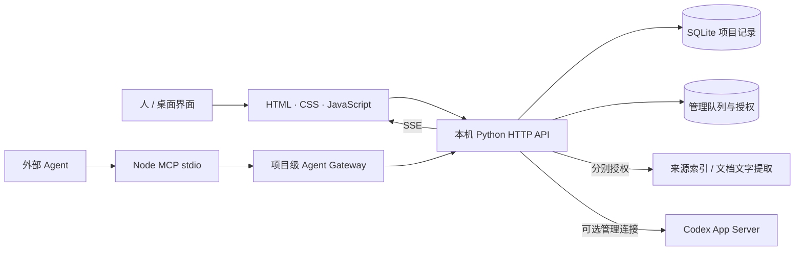

# 架构与数据流

研序是本机单人项目工作空间。浏览器/原生宿主呈现同一套界面，本机 Python 服务持有项目记录。普通管理功能可离线使用；可选 AI 通道独立启用。

## 关键对象

| 对象 | 职责 |
| --- | --- |
| Project | 稳定目标、描述、约束、项目工作区 |
| Task | 人安排的工作、阶段、依赖和日期 |
| Action | Agent 认领的行动、原契约、预算、停止条件与报告 |
| Artifact | 成果引用与版本；登记不复制原文件 |
| Result / Evidence | 结果、来源对象和版本、报告状态与核验等级 |
| Proposal / Decision | 需要人审核的建议、范围或方向变化 |
| Event / Handoff | 变更历史与接续上下文 |

## 状态与接续

Today 的下一步与 Agent 接续简报取自同一项目快照。`context_hash` 用于发现过期上下文；严格接口检查当前版本、行动判据、预算与停止条件。不同版本的旧兼容调用没有完全相同的门禁，不应混用保证。

项目写入采用版本检查；预检查、提交和读回分别处理。SSE 推送变更，让页面更新。行动结束追加结果与依据，不把失败或未知改写成成功。

普通任务、Agent 行动、交付状态、报告结果、独立核验分别保存。人批软件复核收据也不自动证明科学结论。

## 数据与授权

默认项目数据保存于当前用户的 ResearchDesk 数据目录；桌面测试版使用 ResearchDeskBeta。项目数据库、账号缓存、连接令牌、来源目录均不进入源码仓库。

工作区绑定、读取本地文件、允许 PDF/DOCX 文字提取和发送正文分别确认。授权范围或来源版本变化会触发失效检查。应用层路径策略不提供 OS 沙箱或跨 Agent 文件写入锁。

## 模块入口

| 文件 | 作用 |
| --- | --- |
| `index.html` | 三栏界面、项目视图、设置与接续入口 |
| `server.py` / `launcher.py` | 本机服务、持久化、接口与单实例启动 |
| `agent_gateway.py` / `mcp-server.js` | 项目级 Agent 接口与 MCP |
| `project_continuity.py` / `action_contracts.py` | 接续规则与行动契约 |
| `agent_manager.py` / `registered_batches.py` | 可选管理总结、快照分批与队列 |
| `agent_connection.py` / `management_runtime.py` | Codex 通道与有限核查执行器 |
| `source_bridge.py` / `workspace_registry.py` | 来源授权与工作区路径规则 |
| `document_text.py` / `document_worker.py` | PDF/DOCX 受限文字提取 |
| `project_backup.py` / `result_review.py` | 备份与追加复核收据 |
| `packaging/` | 固定运行库、原生宿主、安装、自检与源包导出 |

## 技术取舍

Python 标准库与 SQLite 降低普通功能的安装成本。网页界面与 WKWebView 共享逻辑，减少桌面/UI 分叉。项目级令牌提供应用层权限边界，保留旧接口供迁移。主界面保留单文件实现，阅读与模块化维护成本是后续工程改进项。

目前没有多用户公网部署架构、跨 Agent 文件锁、云端调度保证或完整语义重跑识别。

---

# English · Architecture and data flow

Yanxu is a local single-user workspace. The browser and native host share an HTML/CSS/JavaScript interface backed by a local Python HTTP API and SQLite. Basic project management works offline; optional AI channels are enabled separately. SSE delivers state changes to the interface. External agents connect through Node MCP stdio and the project-scoped Agent Gateway. Source indexing, document extraction and the Codex management connection have separate consent gates.

| Object | Responsibility |
| --- | --- |
| Project | Stable goal, description, constraints and workspace |
| Task | Human-planned work, stages, dependencies and dates |
| Action | Agent claim, original contract, budget, stop conditions and reports |
| Artifact | Deliverable reference and version; registration does not copy the original file |
| Result / Evidence | Result, source object/version, reported status and verification level |
| Proposal / Decision | Human-reviewed suggestions and changes of scope or direction |
| Event / Handoff | Change history and resumption context |

Today and the agent handoff derive from the same project snapshot. `context_hash` detects stale context; strict interfaces check revisions, criteria, budgets and stop conditions. Legacy compatibility tools do not offer identical gates. Writes separate preview, commit and readback; completion appends results/evidence without rewriting failures or unknowns into successes. Delivery, reported results and independent verification are separate records.

Normal data lives in the user's ResearchDesk directory; desktop beta data uses ResearchDeskBeta. Databases, account caches, tokens and source directories are excluded from source distribution. Workspace binding, local reading, PDF/DOCX extraction and sending text require separate confirmation. Changed consent or source versions trigger invalidation checks. Path rules do not provide an OS sandbox or cross-agent file locks.

The module table above names the entry points: `index.html` (UI); `server.py` / `launcher.py` (service and single-instance launch); `agent_gateway.py` / `mcp-server.js` (agent interfaces); `project_continuity.py` / `action_contracts.py` (handoffs/contracts); `agent_manager.py` / `registered_batches.py` (summary queue/batches); `agent_connection.py` / `management_runtime.py` (Codex channel/review); `source_bridge.py` / `workspace_registry.py` (consent/path policy); `document_text.py` / `document_worker.py` (text extraction); `project_backup.py` / `result_review.py` (backup/review receipts); and `packaging/` (distribution).

Python's standard library and SQLite reduce setup costs; sharing the web interface with WKWebView reduces UI divergence. Project tokens provide application-level scopes; legacy tools remain for migration. The large single-file UI still has maintenance costs. Multi-user hosting, cloud scheduling guarantees, cross-agent write locks and complete semantic replay detection are not implemented.
