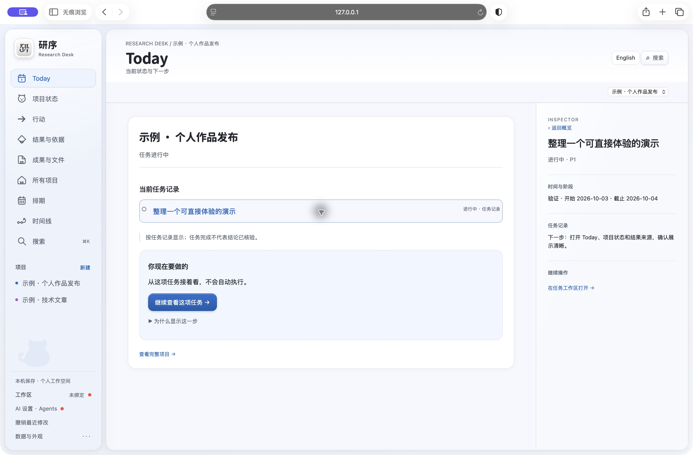
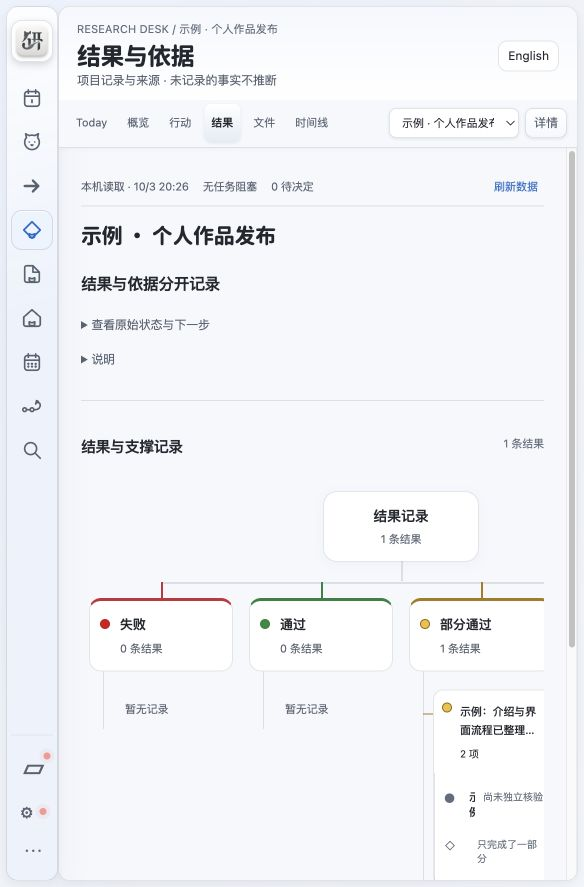

# 产品问题、设计取舍与作品介绍

## 从一个真实工作困扰开始

长期使用 AI 推进项目时，“继续工作”需要同时找回目标、上次动作、成果位置、未解决问题和下一步。对话擅长交流，文件擅长保存产物，任务列表擅长排期，但这些记录容易分离。研序尝试让人和 Agent 面向同一组可追溯项目记录。

## 目标用户与核心路径

优先面向用 AI 推进长期科研、软件、设计和写作项目的个人。核心路径是：建立目标 → 明确行动 → 推进和登记 → 找到来源 → 中断后接续。普通项目管理无需连接 AI。

## 三个设计取舍

1. **少展示，能追溯。** Today 只保留当前记录、必要提醒和一个下一步入口；原记录、版本、限制和交接按需展开。
2. **人决定，Agent 有边界地执行。** 模型建议、资料读取、发送正文和行动授权分别管理；关键方向和范围变化保留人审核入口。
3. **交付与可信度分开。** 任务完成可以伴随失败或未知结果。结果登记绑定来源版本，独立核验另记，避免把执行成功当作结论正确。

## 示例走查

运行 `python3 scripts/start_demo.py`，选择「示例 · 个人作品发布」。全部内容为人工合成示例，未调用真实模型。

1. Today：读当前任务和下一步，打开对应记录。
2. 项目状态：找到目标、阶段与最近变更。
3. 行动 / 结果与依据：查看示例行动的原契约，以及“部分完成 / 未核验”结果的来源版本。
4. 排期：看到已有依赖与日期。
5. 切换项目：另一示例项目保持独立记录。

## 面试中可以讨论什么

| 能力 | 可查看的实现 |
| --- | --- |
| 产品问题与范围定义 | 本文中的长期项目接续路径、目标用户和取舍 |
| 信息架构与交互 | 三栏、Today 单主动作、按需展开原依据 |
| AI 产品权限设计 | 连接、读取、发送、行动授权分别处理 |
| 全栈工程 | 本机 Python API、SQLite、SSE、原生 JS、Node MCP |
| 可靠性设计 | 版本冲突、重复认领、授权撤回、中断对账与负结果保留 |
| 桌面交付 | macOS WKWebView、Windows 安装脚本、固定运行库和自检 |

代码和测试展示实现能力；用户规模、节省时间、商业收益和市场优势目前没有实测依据，不能写成项目成果。

## 简历介绍示例

**研序 Yanxu｜个人开源项目：面向 AI 协作的本地项目工作空间**

- 围绕长期项目在 AI 对话、文件和任务之间难以接续的问题，设计项目目标、行动、成果、结果和来源版本的统一工作流，以及三栏界面与 Today 接续入口。
- 使用 Python、SQLite、原生 JavaScript 和 Node MCP 实现本机项目管理与 Agent 接入；处理版本冲突、授权撤回、行动预算、来源追溯与未核验结果。
- 提供 macOS Apple Silicon 与 Windows x64 测试包、隔离示例和自动回归；Windows 原生运行及长期用户收益仍待验证。

使用时按实际参与程度改写“设计 / 实现 / 主导”，如面试被问到 AI 辅助开发，应如实说明开发和验证方式。公开仓库链接、演示截图与可运行示例是作品入口，不用虚构用户数或效率提升百分比。
