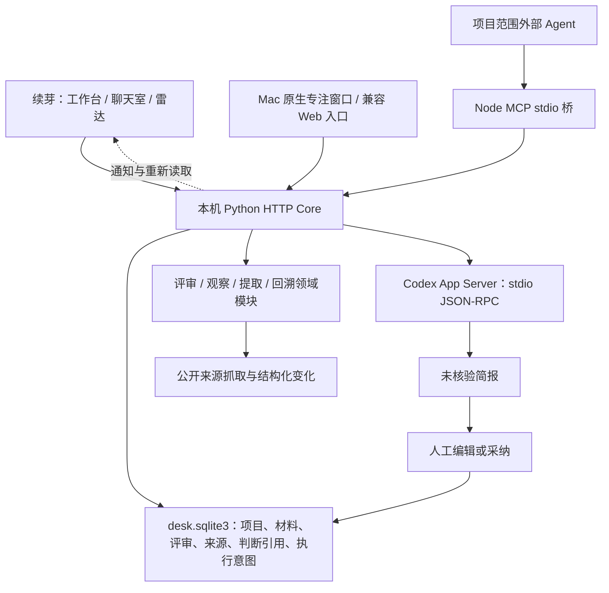

# 续芽生态：模块化单体与三个独立入口

当前公开源码：2026.10.08-source-preview.1。工作台 `/`、聊天室 `/apps/discussion/`、雷达 `/apps/radar/` 是三个平级应用入口，共享本机核心与限定项目上下文。评审和观察能力仍使用既有领域模块；旧启动器与协议标识保留兼容，没有重建一套项目系统。

## 技术栈与所有权

| 层 | 当前实现 | 责任 |
|---|---|---|
| Web UI | 原生 HTML/CSS/JavaScript，三栏，ecosystem.js / review_ui.js，共用 ecosystem_client.js / ecosystem_state.js | 输入、预览、引用定位、编辑和状态展示 |
| 应用服务 | Python 标准库 HTTP，server.py / ecosystem.py | 鉴权、业务事务、执行门禁、采纳和历史 |
| 评审 | review_service.py / review_context.py | 材料版本、七字段结构、行号验证、简报版本和 Markdown |
| 观察 | observation_service.py / source_extractors.py / radar_fetch.py | 覆盖/过期/失败、条目解析与变化、公开地址读取 |
| 回溯 | lineage_service.py | 评审→任务/判断→Action→Result 的已登记引用，只读展示 |
| 扩展 | extension_contracts.py / ecosystem_contracts.py | 来源包校验，核心身份、能力与兼容版本 |
| 存储 | SQLite | desk.sqlite3 业务与生态；manager.sqlite3 管理队列；agent-connection.sqlite3 连接和会话 |
| Agent 接入 | Node.js MCP stdio，项目范围 HTTP | 外部只通过 API 读/写获准能力，不持有主人令牌 |
| 桌面 | Swift AppKit/WKWebView；既有 Windows 宿主 | 本机核心生命周期、文件选取/保存、窗口 |

普通运行不要求 React、TypeScript 或微服务。Node 是 MCP 桥/runtime，前端本身仍为原生 JS。新服务模块已拆分；生态 API 客户端与项目读取状态分别独立，主项目 UI 仍为原宿主。客户端注入宿主 transport，不保存凭据；状态模块处理请求归属、读取重叠、版本回退与不变对象身份。共享评审组件在 review_ui.js，通用表单仍由宿主组织。

## 通信与事务

1. UI 向 loopback HTTP API 发送 JSON；主人令牌只存在本机，Agent 令牌限定项目与 READ/PROPOSE/EXECUTE。读取不调用模型。写入先 dry，旧请求用 ifRev，受支持的对象更新可用 expected_rev。
2. 同库来源变化、持久收件项和去重在事务中保存。SSE 和只读轮询帮助刷新界面，业务事实以数据库为准。
3. Codex 连接使用 stdio JSON-RPC。model/list 取得真实模型；显式保存模型只改研序，心跳不调用模型。评审 turn 使用只读/无网络环境及禁用工具配置；异常或非授权活动隔离，未自动重放。
4. 模型预算预留、attempt 和发送授权先持久化；RPC 在写事务之外执行。晚到回复、上下文变化、停止/失败/过期均拒绝写当前结果。外部执行的真正终止和计费需执行器对账。
5. 普通同库备份恢复保留 ecosystem_usage 的最大消耗与契约哈希，业务对象 revision 单调推进。不能以此宣称数据库文件替换或跨机器导入拥有全球一次执行保证。
6. 启动器先检查实例源码、数据路径及 build_id，拒绝连接同路径但旧源码的核心。healthz 宣告 ecosystem v2 / review-brief v1 / extractor v1 / external-reply v1。已有兼容 API 继续存在，外部客户端应先发现能力。

## 主要对象与闭环

评审保存 question、constraints、1–12 份明确材料、内容 SHA-256、行号、执行器快照、run_id/预算、原始回复、简报修订和采纳回执。输出七项内容并附 claim/material_id/locator/relation。行号合法只证明可以定位，source 不代表内容已核实。人工修改保留原始回复和理由；已采纳版本保留，新判断需新评审。

观察以关注问题和所选来源为范围。RSS/Atom/JSON Feed 按条目身份提取标题、链接、日期、摘要和版本，区分新增、更新与移除；元数据/导航变化不冒充有效内容变化。覆盖包含成功、失败、过期、未检查，暂停和到期另记。选定来源范围不等于整个领域；条目字段不等于链接全文。

来源只能通过显式 decision_ids 生成有关旧判断的待复核候选。旧判断和已执行结果不被自动推翻。人采纳后保存 review_ref、材料版本、复核条件；项目详情可从这些引用回看来源。Action/Result 延续原授权和证据等级。真实结果反向提出观察规则修改为后续工作。

## 交付与边界

2026-10-08 交付为源码预览，运行方式见根 README.md。当前三应用界面没有对应的新桌面安装包；Releases 中 beta.16 是历史桌面版本，不能用其原生验收替代当前源码验证。当前验证范围见 `../receipts/source-preview-v2-20261008.json`；真实模型效果、独立用户收益、跨平台原生安装仍需单独验收。

个人空间是本机单用户的逻辑分组，共享主人权限，不能当作多租户隔离或 OS 沙箱。绑定目录、读取文件、正文外发、模型运行、采纳为不同边界。手选材料不会自动扫描项目目录。新评审通过 context_selection 明确选择任务/判断/结果，默认不选；复核判断自动包含。选定快照实际发送且承担失效依赖，项目对象变化仍拒绝。旧评审保持全项目 context_hash；跨项目采纳新增目标项目对象版本，旧客户端保持全目标快照门禁。历史快照须以明确理由另建评审，保留原来源/版本/消耗，转为固定材料；新评审仍绑定当前项目及选定当前记录。review_history.py 负责范围冻结和便携收据自洽校验，不能把它称为独立来源核验。

preview.7：result_observation.py为纯规则建议/收据模块；ecosystem.view组合显式Result/Action/采纳任务/room/既有关联watch链，返回result_observation候选/总数。watch.result.resolve为owner-only事务，核对source_hash/basis_hash/object_rev，只变规则与收据，不启动网络/模型，不改来源或原结果。已处理同来源版本不重复提示；收据随watch备份，自洽验证不等于独立核验。界面默认keep，modify后可编辑问题/关键词/频率，再明确理由/勾选保存。候选前50、每来源50收据；超量不默丢历史。

preview.8：项目Today等核心读取先await loadState，再冻结本次有效正式项目。初始/移除的选择清除旧缓存，空列表不调用Gateway隐含默认个人空间；读取中view/selection/sequence变化放弃旧操作。返回的project/context与Today id不匹配拒绝提交缓存，Today在错项目缓存存在时只显示读取中。所有调用仍GET，无模型或写入。
